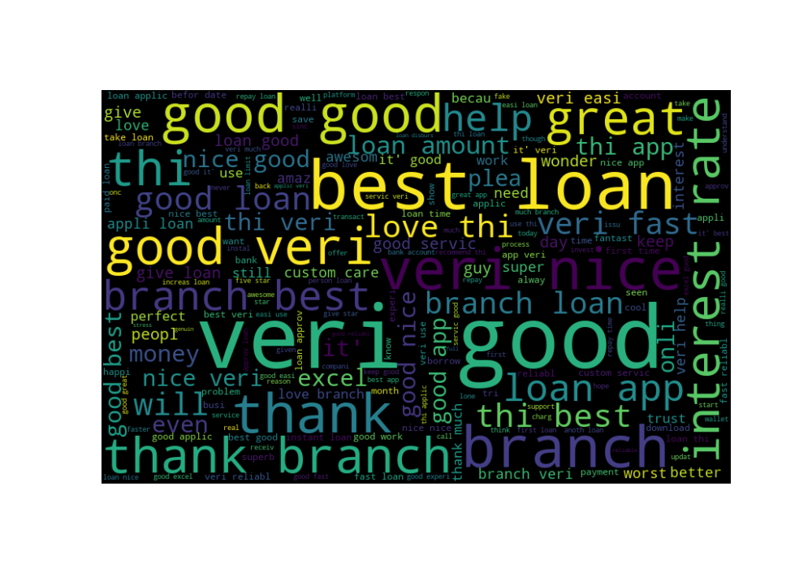
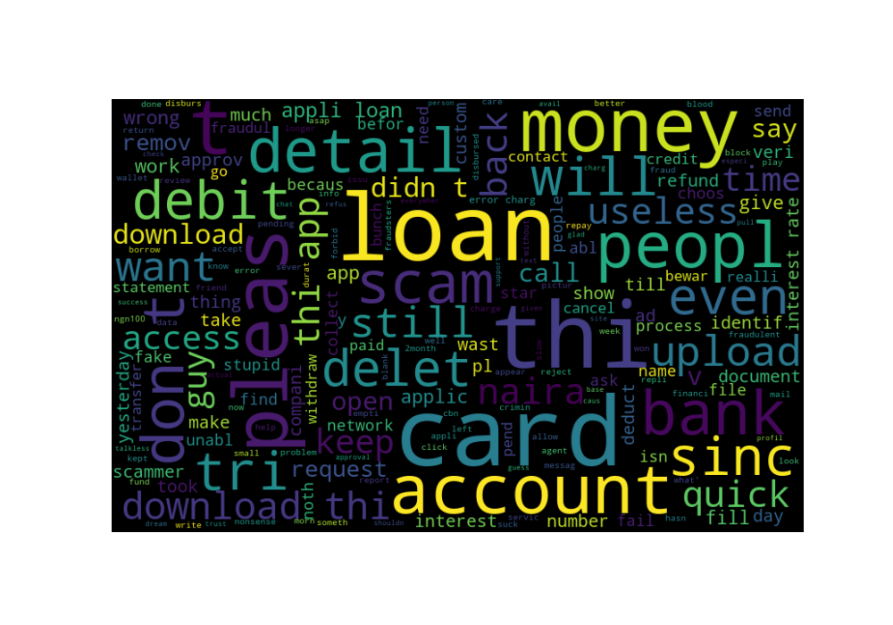
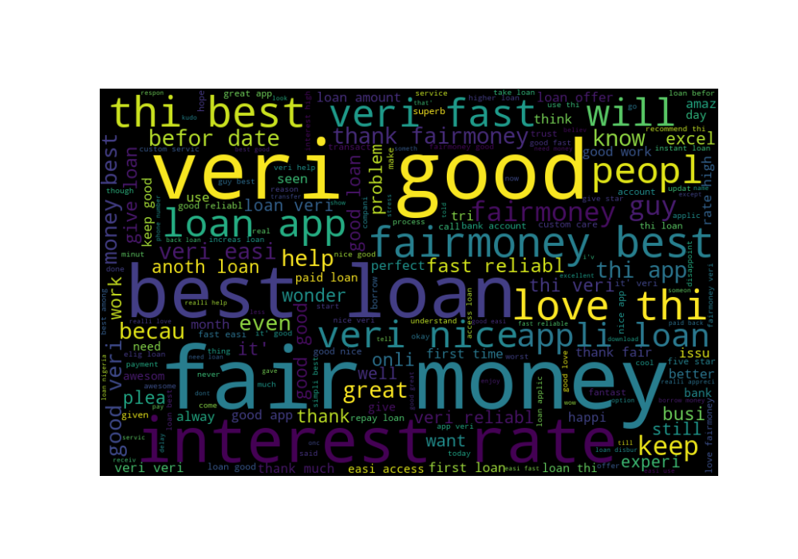

# Sentiment Analysis on Digital Lending platforms in Nigeria
==============================
                                                                    
This study was inspired by a [Premium Times publication](https://www.premiumtimesng.com/news/headlines/499999-investigation-how-digital-loan-providers-breach-data-privacy-violate-rights-of-nigerians.html) highlighting how digital loan providers breach data privacy, and violate rights of Nigerians.
The sentiment analysis firsts extracts all the reviews from three digital lending platforms in both Googleplay store and Appstore, then processes the data, and critically analyses it, before then using Machine learning to conduct a sentiment Analysis.                           
**Branch Digital Lending Platform** [*visit site*](https://branch.com.ng/)
<p align="center">
  
</p>
                      
**QuickCredit Digital Lending Platform** [*visit site*](https://quickcredit.com.ng/)
<p align="center">
  
</p>
      
**Fairmoney Digital Lending Platform** [*visit site*](https://fairmoney.ng/)
<p align="center">
  
</p>
      
This repository contains the code and documentation for a sentiment analysis project on digital lending platforms in Nigeria. The project uses natural language processing techniques to analyze customer reviews of digital lending platforms in Nigeria, and to understand the overall sentiment of customers towards these platforms.

## Requirements                                      
Python 3.x                        
NLTK                                   
pandas                             
numpy                                     
scikit-learn                         
seaborn               
matplotlib                        

## Usage                                   
**Clone this repository to your local machine.**                                            
```bash     
git clone https://github.com/obinopaul/Sentiment-Analysis-Loan-App.git                                      
```      

**Install the required packages.**                                                        
```bash    
pip install -r requirements.txt                         
```    
    
**Run the Jupyter notebook file sentiment_analysis.ipynb to train the model and make predictions on new data.**             
*The notebook contains detailed instructions and explanations of the code.*                             

## Data
The data used in this project is a collection of customer reviews of digital lending platforms in Nigeria. The data was collected from customer reviews of six lending platforms: **Quickcredit**,  **Carbon**,  **Newcredit**,  **Fairmoney**,  **Branch**, and **Palmcredit** on both applestore and googleplay store where their application is hosted.

## Results                                                                 
The model achieved an accuracy of 80% on the test set. Additionally, the model was able to classify positive, negative and neutral sentiments with good precision and recall. The results are visualized using various plots and charts.
                        
## Note                                                                                
This is a simplified version of the Sentiment Analysis problem, just for demonstration purposes. In the real world scenario, the dataset would be much more complex and the model would have to be fine-tuned and optimized to work with it.
